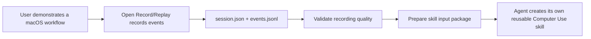
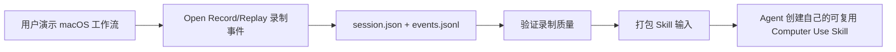

<h1 align="center">Open Record/Replay</h1>

<p align="center">
  <strong>Teach Computer Use agents by demonstration.</strong>
</p>

<p align="center">
  Record a macOS workflow once, save the evidence, and let an agent turn it into a reusable skill.
</p>

<p align="center">
  <a href="https://github.com/humblebanana/open-record-replay/actions/workflows/ci.yml"></a>
  <a href="./LICENSE"></a>
  
  
</p>

<p align="center">
  English | <a href="#简体中文">简体中文</a>
</p>

Open Record/Replay is a local-first macOS recorder for workflows that are easier to show than to write down. It captures a user's real desktop actions into structured artifacts such as `session.json` and `events.jsonl`, validates the recording quality, and packages the evidence for an agent's skill creation flow.

The goal is simple: if a user can demonstrate a desktop workflow once, an agent should have enough evidence to learn it.



## Why This Exists

Some workflows are hard to describe as prompts:

- They depend on visible desktop UI.
- They involve file pickers, menus, modals, or drag-and-drop.
- They span multiple apps.
- They depend on personal workspace layout or team-specific conventions.
- They are easier to learn from a demonstration than from a written runbook.

Open Record/Replay gives agents a concrete evidence stream instead of asking them to infer the workflow from a vague description.

## What You Can Record

Open Record/Replay can capture action-level evidence for workflows such as:

- Sending files or images through a desktop chat app.
- Creating a document and sharing its link.
- Opening a browser page, searching, and starting the right media.
- Moving between browser and desktop apps.
- Repeating a UI process that is not covered by a clean API or connector.

The recorder can capture:

- `window.changed`
- `mouse.click`
- `mouse.drag`
- `keyboard.text_input`
- `keyboard.submit`
- `selection.changed`
- app/window attribution
- UI targets
- selected items
- Accessibility tree or diff context

`events.jsonl` is the primary evidence. Screenshots are not part of the current core recording path.

## What It Is Not

Open Record/Replay is not a coordinate macro recorder, a screenshot-first recorder, a cloud recording service, or a final skill generator.

It does not try to create the final skill by itself. Different agents have different skill formats, install locations, trigger rules, and validation workflows. Open Record/Replay records and packages the evidence; the current agent should create the final skill in its own native format.

## Quick Demo

This is the typical flow for teaching an agent a new desktop workflow.

```bash
git clone https://github.com/humblebanana/open-record-replay.git
cd open-record-replay
npm install
npm run check
```

Check macOS permissions:

```bash
node bin/orr.js permissions check
```

Request missing permissions:

```bash
node bin/orr.js permissions request
```

Start a recording:

```bash
node bin/orr.js record start --name send-file-demo --out runs --request-permissions
```

Now demonstrate the workflow on your Mac. For example:

1. Open a desktop chat app.
2. Choose a recipient or channel.
3. Attach a local file.
4. Confirm the upload.
5. Send a short follow-up message.

When finished, stop the recording:

```bash
node bin/orr.js record stop latest
```

Validate the evidence:

```bash
node bin/orr.js session validate-recording latest
```

Prepare a skill input package:

```bash
node bin/orr.js skill prepare latest --runs runs --out skill-inputs
```

The package will be written to:

```text
skill-inputs/<session-id>/
├── README.md
├── events.jsonl
└── session.json
```

Give this directory to the current agent's skill creation flow.

## Output Artifacts

Recording output:

```text
runs/sessions/<session-id>/
├── session.json
├── events.jsonl
├── orr_session.json
└── recording_manifest.json
```

Skill input package:

```text
skill-inputs/<session-id>/
├── README.md
├── events.jsonl
└── session.json
```

`session.json` records the recording boundary, timing, and event path. `events.jsonl` is the source of truth for what happened during the demonstration.

## Agent Integration

This repository includes a host instruction skill:

[skills/open-record-replay/SKILL.md](./skills/open-record-replay/SKILL.md)

An agent should use it to understand when to start recording, when to stop, how to inspect `events.jsonl`, and how to hand the evidence package to its own skill creation flow.

Expected agent flow:

1. Check or request required macOS permissions.
2. Start recording only when the user is ready.
3. After recording starts, stop the current turn and wait for the user to finish the demonstration.
4. Stop the recorder when the user says the demonstration is complete.
5. Read `session.json` and `events.jsonl`.
6. Validate the recording.
7. Prepare the skill input package.
8. Use the agent's own skill creation system to create and validate the final skill.

## CLI Reference

```bash
node bin/orr.js permissions check
node bin/orr.js permissions request
node bin/orr.js record start --name my-workflow --out runs --request-permissions
node bin/orr.js record stop latest
node bin/orr.js session list
node bin/orr.js session inspect latest
node bin/orr.js session events latest
node bin/orr.js session validate-recording latest
node bin/orr.js skill prepare latest --runs runs --out skill-inputs
```

The CLI also contains experimental workflow and demo commands. The stable public path is recording, validation, and skill input packaging.

## Requirements

- macOS.
- Node.js 18+.
- Swift toolchain / Xcode Command Line Tools.
- Accessibility permission.
- Input Monitoring permission.

The core recorder does not require Screen Recording.

## Privacy

Recordings are local by default, but `events.jsonl` can contain sensitive data:

- Window titles.
- URLs.
- Typed text.
- Selected text.
- File names.
- Local paths.
- Accessibility tree text from apps and web pages.

Review recordings before sharing them. Do not publish raw recordings that contain secrets, private documents, customer data, internal URLs, or personal information.

See [Privacy](./docs/privacy.md).

## Status

Open Record/Replay is alpha software.

Current public scope:

```text
macOS native recorder
+ CLI
+ session.json / events.jsonl
+ recording validation
+ skill input package
+ host-agent skill creation handoff
```

Future work may include richer adapters, visual evidence, an inspector UI, and replay experiments. They are not part of the current stable public path.

## Documentation

- [Installation](./docs/install.md)
- [Agent Usage](./docs/agent-integration.md)
- [Recording Data Contract](./docs/recording-data-contract.md)
- [Privacy](./docs/privacy.md)
- [Release Checklist](./docs/release-checklist.md)
- [Contributing](./CONTRIBUTING.md)

---

# 简体中文

<p align="center">
  <a href="#open-recordreplay">English</a> | 简体中文
</p>

Open Record/Replay 用来通过一次真实演示，让 Computer Use Agent 学会一个 macOS 桌面工作流。

它会把用户在 Mac 上的真实操作录制成 `session.json` 和 `events.jsonl`，检查录制质量，并打包成 Agent 可以读取的 Skill 输入包。最终 Skill 不由 Open Record/Replay 直接生成，而是交给当前 Agent 使用自己的 Skill 创建流程完成。

核心目标很简单：如果用户可以演示一次工作流，Agent 就应该有足够的证据去学习它。



## 为什么需要它

有些工作流很难直接写成提示词：

- 它依赖真实桌面 UI。
- 它涉及文件选择器、菜单、弹窗或拖拽。
- 它横跨多个 App。
- 它依赖个人工作区布局或团队内部习惯。
- 用户演示一次，比写一份很长的操作说明更清楚。

Open Record/Replay 给 Agent 的不是模糊描述，而是一份真实事件证据流。

## 可以录制什么

典型场景包括：

- 在桌面聊天 App 里发送文件或图片。
- 创建文档并分享链接。
- 打开网页、搜索内容并播放指定媒体。
- 在浏览器和桌面 App 之间切换操作。
- 复现一个没有稳定 API 或 connector 的 UI 流程。

录制器可以捕捉：

- `window.changed`
- `mouse.click`
- `mouse.drag`
- `keyboard.text_input`
- `keyboard.submit`
- `selection.changed`
- App / 窗口归属
- UI target
- 选中文件或文本
- Accessibility tree / diff 上下文

`events.jsonl` 是最关键的证据。截图不是当前核心录制链路的一部分。

## 它不是什么

Open Record/Replay 不是纯坐标宏录制器，不是截图优先的录制器，不是云端录制服务，也不是最终 Skill 生成器。

它不会自己决定最终 Skill 的格式。不同 Agent 的 Skill 格式、安装位置、触发规则和验证方式都不一样。Open Record/Replay 负责录制和打包证据；最终 Skill 应该由当前 Agent 用自己的原生格式创建。

## 快速演示

安装并检查项目：

```bash
git clone https://github.com/humblebanana/open-record-replay.git
cd open-record-replay
npm install
npm run check
```

检查 macOS 权限：

```bash
node bin/orr.js permissions check
```

请求缺失权限：

```bash
node bin/orr.js permissions request
```

开始录制：

```bash
node bin/orr.js record start --name send-file-demo --out runs --request-permissions
```

然后在 Mac 上演示你的工作流。比如：

1. 打开一个桌面聊天 App。
2. 选择联系人或群聊。
3. 附加一个本地文件。
4. 确认上传。
5. 发送一条补充消息。

完成后停止录制：

```bash
node bin/orr.js record stop latest
```

验证录制质量：

```bash
node bin/orr.js session validate-recording latest
```

准备 Skill 输入包：

```bash
node bin/orr.js skill prepare latest --runs runs --out skill-inputs
```

产物会写入：

```text
skill-inputs/<session-id>/
├── README.md
├── events.jsonl
└── session.json
```

把这个目录交给当前 Agent 的 Skill 创建流程即可。

## 产物结构

录制输出：

```text
runs/sessions/<session-id>/
├── session.json
├── events.jsonl
├── orr_session.json
└── recording_manifest.json
```

Skill 输入包：

```text
skill-inputs/<session-id>/
├── README.md
├── events.jsonl
└── session.json
```

`session.json` 记录录制边界、时间和事件路径。`events.jsonl` 是判断用户到底做了什么的 source of truth。

## Agent 如何接入

仓库里包含一个给 Agent 使用的说明 Skill：

[skills/open-record-replay/SKILL.md](./skills/open-record-replay/SKILL.md)

Agent 应该通过它理解什么时候开始录制、什么时候停止、如何读取 `events.jsonl`，以及如何把证据包交给自己的 Skill 创建流程。

推荐流程：

1. 检查或请求必要的 macOS 权限。
2. 只在用户准备好时开始录制。
3. 录制开始后，Agent 停止当前回合，等待用户演示完成。
4. 用户说完成后，Agent 停止录制。
5. 读取 `session.json` 和 `events.jsonl`。
6. 验证录制质量。
7. 准备 Skill 输入包。
8. 使用当前 Agent 自己的 Skill 创建系统生成并验证最终 Skill。

## CLI 命令

```bash
node bin/orr.js permissions check
node bin/orr.js permissions request
node bin/orr.js record start --name my-workflow --out runs --request-permissions
node bin/orr.js record stop latest
node bin/orr.js session list
node bin/orr.js session inspect latest
node bin/orr.js session events latest
node bin/orr.js session validate-recording latest
node bin/orr.js skill prepare latest --runs runs --out skill-inputs
```

CLI 里还保留了一些实验性的 workflow 和 demo 命令。当前稳定公开路径是：录制、验证、打包 Skill 输入。

## 环境要求

- macOS。
- Node.js 18+。
- Swift toolchain / Xcode Command Line Tools。
- Accessibility 权限。
- Input Monitoring 权限。

核心录制器不需要 Screen Recording 权限。

## 隐私

录制默认保存在本地，但 `events.jsonl` 可能包含敏感信息：

- 窗口标题。
- URL。
- 输入文本。
- 选中文本。
- 文件名。
- 本地路径。
- App 和网页里的 Accessibility tree 文本。

分享录制前必须先检查内容。不要公开包含密钥、私有文档、客户数据、内部 URL 或个人信息的原始录制。

详见 [Privacy](./docs/privacy.md)。

## 项目状态

Open Record/Replay 目前是 alpha 版本。

当前公开范围：

```text
macOS 原生录制器
+ CLI
+ session.json / events.jsonl
+ 录制质量验证
+ Skill 输入包
+ 交给宿主 Agent 创建最终 Skill
```

未来可能会增加更丰富的适配器、视觉证据、Inspector UI 和 replay 实验，但这些不是当前稳定公开路径。

## 文档

- [安装说明](./docs/install.md)
- [Agent 使用说明](./docs/agent-integration.md)
- [录制数据契约](./docs/recording-data-contract.md)
- [隐私说明](./docs/privacy.md)
- [发布检查清单](./docs/release-checklist.md)
- [贡献指南](./CONTRIBUTING.md)
